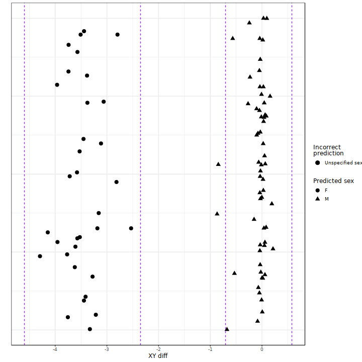
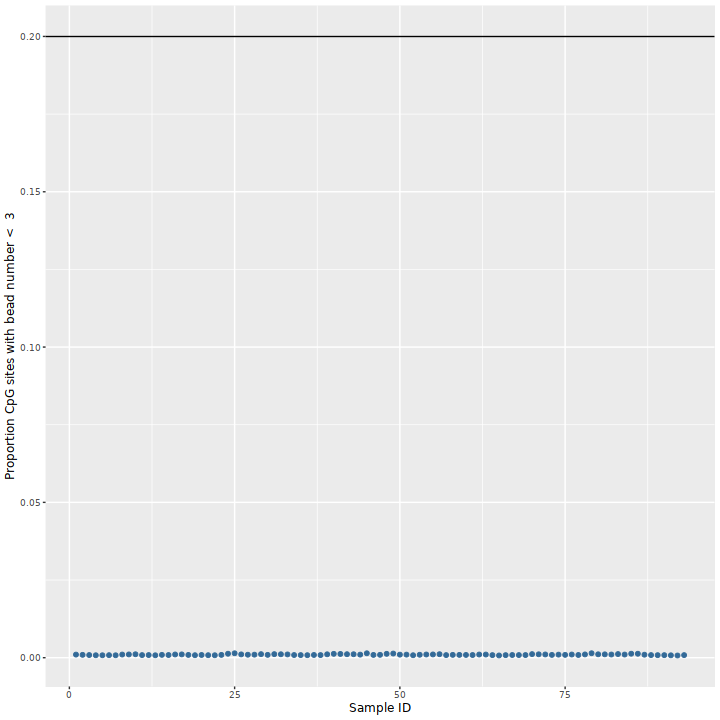

# QC report
- study: pleural-dnam
- author: Paul Yousefi
- date: 08 September, 2023

## Parameters used for QC


```
## $colour.code
## NULL
## 
## $control.categories
## NULL
## 
## $sex.outlier.sd
## [1] 3
## 
## $meth.unmeth.outlier.sd
## [1] 3
## 
## $control.means.outlier.sd
## [1] 5
## 
## $detectionp.samples.threshold
## [1] 0.2
## 
## $beadnum.samples.threshold
## [1] 0.2
## 
## $detectionp.cpgs.threshold
## [1] 0.2
## 
## $beadnum.cpgs.threshold
## [1] 0.2
## 
## $snp.concordance.threshold
## [1] 0.9
## 
## $sample.genotype.concordance.threshold
## [1] 0.9
## 
## $detection.threshold
## [1] 0.01
## 
## $bead.threshold
## [1] 3
## 
## $sex.cutoff
## [1] -2
```
## Number of samples

There are 96 samples analysed.

## Sex mismatches

To separate females and males, we use the difference of total median intensity for Y chromosome probes and X chromosome probes. This will give two distinct clusters of intensities. Females will be clustered on the left and males on the right. 
There are 2 sex detection outliers, and 0 sex detection mismatches.


|sample.name         |predicted.sex |declared.sex |   xy.diff|status  |
|:-------------------|:-------------|:------------|---------:|:-------|
|207563380070_R04C01 |M             |NA           | -1.460327|outlier |
|207563380152_R01C01 |M             |NA           | -1.270341|outlier |

This is a plot of the difference between median 
chromosome Y and chromosome X probe intensities ("XY diff").
Cutoff for sex detection was
XY diff = -2. Mismatched samples are shown in red. The dashed lines represent 3 SD from  the mean xy difference. Samples that fall in this interval are denoted as outliers.





## Methylated vs unmethylated
To explore the quality of the samples, it is useful to plot the median methylation intensity against the median unmethylation intensity with the option to color outliers by group.
There are 1 outliers from the meth vs unmeth comparison.
Outliers are samples whose predicted median methylated signal is
more than 3 standard deviations
from the expected (regression line).


|sample.name         | methylated| unmethylated|   resids| methylated.lm| upper.lm| lower.lm|outliers |
|:-------------------|----------:|------------:|--------:|-------------:|--------:|--------:|:--------|
|207563380118_R07C01 |   4512.508|     1509.622| 1227.502|      3285.007|  4458.13| 2111.884|TRUE     |

This is a plot of the methylation signals vs unmethylated signals


## Control probe means

There were 0 outliers detected based on deviations from mean values for control probes. The 450k array contains control probe which can be used to evaluate the quality of specific sample processing steps (staining, extension,target removal, hybridization, bisulfate conversion etc.).  Control probes are grouped in 42 categories of control type. For each category a plot has been generated which shows the control means for each sample. Outliers are deviations from the mean. Some of the control probe categories have a very small number of probes. See Page 222 in this doc: https://support.illumina.com/content/dam/illumina-support/documents/documentation/chemistry_documentation/infinium_assays/infinium_hd_methylation/infinium-hd-methylation-guide-15019519-01.pdf. The most important control probes are the bisulfate1 and bisulfate2 control probes. 


The distribution of sample control means are plotted here:


## Sample detection p-values

To further explore the quality of each sample the proportion of probes that didn't pass the detection pvalue has been calculated.
There were 0 samples
with a high proportion of undetected probes
(proportion of probes with
detection p-value > 0.01
is > 0.2).


Distribution:


## Sample bead numbers


To further assess the quality of each sample the proportion of probes that didn't pass the number of beads threshold has been calculated.
There were 0 samples
with a high proportion of probes with low bead number
(proportion of probes with
bead number < 3
is > 0.2).


Distribution:





## CpG detection p-values

To explore the quality of the probes, the proportion of samples that didn't pass the detection pvalue threshold has been calculated.
There were 3662
probes with only background signal in a high proportion of samples
(proportion of samples with detection p-value > 0.01
is > 0.2).
Manhattan plot shows the proportion of samples.


## Low number of beads per CpG

To further explore the quality of the probes, the proportion of samples that didn't pass the number of beads threshold has been calculated.
There were 1 CpGs
with low bead numbers in a high proportion of samples
(proportion of samples with bead number < 3
is > 0.2).
Manhattan plot of proportion of samples.


## Cellular composition estimates


This section omitted.

## SNP probe beta values

The array contains 65 snp probes which can be used to identify sample swaps by comparing these genotypes to genotype calls from a genotype array. First you could check the quality of these snp probes before using them for sample quality.
Distributions of SNP probe beta values are used to determine the quality of the snp probe and should show 3 peaks, one for each genotype probability.


## Genotype concordance


This section omitted.

## R session information


```
## R version 4.1.1 (2021-08-10)
## Platform: x86_64-conda-linux-gnu (64-bit)
## Running under: CentOS Linux 7 (Core)
## 
## Matrix products: default
## BLAS/LAPACK: /data/py16069/miniconda2/envs/alspac/lib/libopenblasp-r0.3.18.so
## 
## locale:
##  [1] LC_CTYPE=en_GB.UTF-8       LC_NUMERIC=C              
##  [3] LC_TIME=en_GB.UTF-8        LC_COLLATE=en_GB.UTF-8    
##  [5] LC_MONETARY=en_GB.UTF-8    LC_MESSAGES=en_GB.UTF-8   
##  [7] LC_PAPER=en_GB.UTF-8       LC_NAME=C                 
##  [9] LC_ADDRESS=C               LC_TELEPHONE=C            
## [11] LC_MEASUREMENT=en_GB.UTF-8 LC_IDENTIFICATION=C       
## 
## attached base packages:
## [1] parallel  stats     graphics  grDevices utils     datasets  methods  
## [8] base     
## 
## other attached packages:
##  [1] readxl_1.3.1          meffil_1.3.6          preprocessCore_1.56.0
##  [4] SmartSVA_0.1.3        RSpectra_0.16-0       isva_1.9             
##  [7] JADE_2.0-3            qvalue_2.24.0         gdsfmt_1.28.1        
## [10] statmod_1.4.36        quadprog_1.5-8        DNAcopy_1.66.0       
## [13] fastICA_1.2-3         lme4_1.1-27.1         Matrix_1.3-4         
## [16] multcomp_1.4-17       TH.data_1.1-0         survival_3.2-13      
## [19] mvtnorm_1.1-3         matrixStats_0.61.0    markdown_1.1         
## [22] gridExtra_2.3         Cairo_1.5-12.2        knitr_1.35           
## [25] reshape2_1.4.4        plyr_1.8.6            sva_3.40.0           
## [28] BiocParallel_1.28.1   genefilter_1.76.0     mgcv_1.8-38          
## [31] nlme_3.1-153          limma_3.50.0          sandwich_3.0-1       
## [34] lmtest_0.9-39         zoo_1.8-9             MASS_7.3-54          
## [37] illuminaio_0.36.0     forcats_0.5.1         stringr_1.4.0        
## [40] dplyr_1.0.7           purrr_0.3.4           readr_2.1.0          
## [43] tidyr_1.1.4           tibble_3.1.6          ggplot2_3.3.5        
## [46] tidyverse_1.3.1      
## 
## loaded via a namespace (and not attached):
##  [1] minqa_1.2.4            colorspace_2.0-2       ellipsis_0.3.2        
##  [4] XVector_0.34.0         fs_1.5.0               base64_2.0            
##  [7] clue_0.3-60            rstudioapi_0.13        farver_2.1.0          
## [10] bit64_4.0.5            AnnotationDbi_1.56.2   fansi_1.0.4           
## [13] lubridate_1.8.0        xml2_1.3.2             codetools_0.2-18      
## [16] splines_4.1.1          cachem_1.0.6           jsonlite_1.7.2        
## [19] nloptr_1.2.2.3         broom_0.7.10           annotate_1.72.0       
## [22] cluster_2.1.2          dbplyr_2.1.1           png_0.1-7             
## [25] compiler_4.1.1         httr_1.4.2             backports_1.4.0       
## [28] assertthat_0.2.1       fastmap_1.1.0          cli_3.6.1             
## [31] tools_4.1.1            gtable_0.3.0           glue_1.6.2            
## [34] GenomeInfoDbData_1.2.7 Rcpp_1.0.7             Biobase_2.54.0        
## [37] cellranger_1.1.0       vctrs_0.3.8            Biostrings_2.62.0     
## [40] xfun_0.28              rvest_1.0.2            mime_0.12             
## [43] lifecycle_1.0.1        XML_3.99-0.8           edgeR_3.34.1          
## [46] zlibbioc_1.40.0        scales_1.1.1           vroom_1.5.6           
## [49] hms_1.1.1              memoise_2.0.0          stringi_1.7.5         
## [52] RSQLite_2.2.8          highr_0.9              S4Vectors_0.32.3      
## [55] BiocGenerics_0.40.0    boot_1.3-28            GenomeInfoDb_1.30.0   
## [58] rlang_0.4.12           pkgconfig_2.0.3        bitops_1.0-7          
## [61] evaluate_0.14          lattice_0.20-45        labeling_0.4.2        
## [64] bit_4.0.4              tidyselect_1.1.1       magrittr_2.0.3        
## [67] R6_2.5.1               IRanges_2.28.0         generics_0.1.3        
## [70] DBI_1.1.1              pillar_1.6.4           haven_2.4.3           
## [73] withr_2.5.0            KEGGREST_1.34.0        RCurl_1.98-1.5        
## [76] modelr_0.1.8           crayon_1.4.2           utf8_1.2.3            
## [79] tzdb_0.2.0             locfit_1.5-9.4         grid_4.1.1            
## [82] blob_1.2.2             digest_0.6.28          reprex_2.0.1          
## [85] xtable_1.8-4           openssl_1.4.5          stats4_4.1.1          
## [88] munsell_0.5.0          askpass_1.1
```
